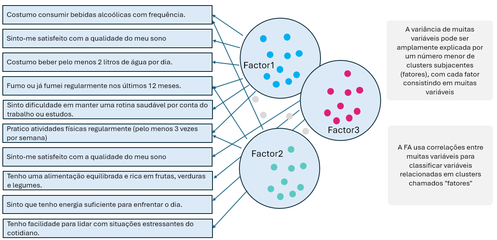

###  [**O que é a EFA**]{style="color: #5AC8BE ;"}

A Análise Fatorial Exploratória (EFA) é uma técnica estatística multivariada usada para identificar a estrutura subjacente (fatores latentes) em um conjunto de variáveis observadas. Ela busca agrupar variáveis correlacionadas entre si em fatores comuns, revelando padrões ocultos nos dados.

É chamada de "exploratória" porque não parte de uma hipótese prévia sobre o número ou a natureza dos fatores, ao contrário da Análise Fatorial Confirmatória (CFA), que testa modelos específicos.



###  [**Qual o objetivo?**]{style="color: #5AC8BE ;"}

O principal objetivo da EFA é reduzir a dimensionalidade dos dados e descobrir estruturas latentes que explicam as correlações entre variáveis. Isso permite:

-   Identificar agrupamentos naturais de variáveis.
-   Compreender melhor os construtos teóricos por trás dos dados.
-   Preparar modelos mais simples e interpretáveis.
-   Apoiar o desenvolvimento de escalas e instrumentos de medida (como questionários).

###  [**De onde vem?**]{style="color: #5AC8BE ;"}

Ela surgiu no campo da psicometria e da psicologia, especialmente para entender traços de personalidade e habilidades cognitivas. Foi desenvolvida como uma resposta à necessidade de compreender fenômenos complexos que não podiam ser observados diretamente, mas inferidos a partir de múltiplas variáveis.

Ela se baseia em conceitos de correlação, covariância e álgebra linear, especialmente decomposição de matrizes.

###  [**Como fazer?**]{style="color: #5AC8BE ;"}

Aqui está um passo a passo prático para realizar uma EFA em R:

1.  Preparar os dados verificando se há dados faltantes, certifique-se de que as variáveis são numéricas e correlacionáveis.

2.  Verificar a adequação dos dados usando teste de Kaiser-Meyer-Olkin (KMO) e ou teste de esfericidade de Bartlett.

3.  Escolher o número de fatores usando scree plot (gráfico de sedimentação), critério de Kaiser (autovalores \> 1), e análise paralela.

4.  Executar a EFA usando a função `factanal()` ou pacotes como `psych` (`fa()`), escolher o método de extração (ex: máxima verossimilhança, componentes principais) e escolher o tipo de rotação (ex: varimax, oblimin).

5.  Interpretar os resultados analisando as cargas fatoriais, verificando comunalidades e variância explicada e validar a consistência dos fatores.

6.  Refinar o modelo eliminando variáveis com baixa carga ou comunalidade e reexecutando a análise se necessário.

Para praticar, iremos usar três exemplos sendo o primeiro com dados contínuos o segundo com com dados categóricos dicotômicos, e terceiro com dados mistos(categóricos dicotômicos e ordinais e numéricos).

::: {.callout-tip collapse="true"}
## **Caso1: Comportamento de consumo com variáveis contínuas**

Imagine que estou conduzindo uma análise fatorial em um questionário com 12 variáveis que representam respostas sobre comportamento de consumo.

Vamos instalar ou chamar os pacotes necessários.

```{r}
#| label: case1_packages
#| warning: false
#| message: false

# Carregue os pacotes ou instale-os no caso de ainda não ter.
library(tidyverse)
library(psych)
library(GPArotation)
```

Vamos criar um conjunto de dados com 12 variáveis que representam respostas a um questionário sobre comportamento de consumo, agrupadas em 3 fatores latentes.

Quando simulamos variáveis contínuas para representar respostas de um questionário, estamos aproximando o comportamento de escalas de Likert que foram normalizadas ou tratadas como contínuas.

As escalas de Likert são ordinais, geralmente com 5 ou 7 pontos, como:

1 = Discordo totalmente 2 = Discordo 3 = Neutro 4 = Concordo 5 = Concordo totalmente

Apesar de serem categorias ordenadas, na prática estatística (especialmente em psicometria e ciências sociais), elas são frequentemente tratadas como variáveis contínuas, principalmente quando há muitos itens (variáveis), a escala tem mais de 4 pontos e os dados são usados em modelos paramétricos como EFA, regressão, etc.

Na simulação abaixo, as variáveis foram geradas como contínuas com ruído, o que simula o comportamento de respostas em Likert. Isso equivale a dizer que os dados passaram por uma transformação ou suavização como por exemplo padronização (z-score), conversão para escala contínua (ex: média de itens), tratamento como intervalares para fins de modelagem.

```{r}

#| label: case1_data
#| warning: false
#| message: false

# este comando permite replicarmos os dados randomicos
set.seed(123)

# Simulando 300 pontos de dados com 3 fatores latentes
n <- 300

fator1 <- rnorm(n)
fator2 <- rnorm(n)
fator3 <- rnorm(n)

dados <- tibble(
  consumo_online1 = fator1 + rnorm(n, 0, 0.5),
  consumo_online2 = fator1 + rnorm(n, 0, 0.5),
  consumo_online3 = fator1 + rnorm(n, 0, 0.5),
  
  fidelidade_marca1 = fator2 + rnorm(n, 0, 0.5),
  fidelidade_marca2 = fator2 + rnorm(n, 0, 0.5),
  fidelidade_marca3 = fator2 + rnorm(n, 0, 0.5),
  
  preocupação_preço1 = fator3 + rnorm(n, 0, 0.5),
  preocupação_preço2 = fator3 + rnorm(n, 0, 0.5),
  preocupação_preço3 = fator3 + rnorm(n, 0, 0.5),
  
  misc1 = rnorm(n),
  misc2 = rnorm(n),
  misc3 = rnorm(n)
)

```

Em seguida, faremos a verificação e adequação dos dados usando funções como KMO e Teste de esfericidade de Bartlett.

```{r}
#| label: case1_kmo
#| warning: false
#| message: false

# Teste KMO
KMO_result <- KMO(cor(dados))
print(KMO_result)

# Teste de esfericidade de Bartlett
cortest.bartlett(cor(dados), n = n)

```

Em seguinda faremos a escolha do número de fatores. O gráfico `Scree Plot` nos ajudará a visualizar o número ideal de fatores com base nos autovalores.

```{r}
#| label: case1_plot
#| warning: false
#| message: false

# Scree plot
fa.parallel(dados, fa = "fa", n.obs = n)

```

Vamos executar da analise fatorial exploratória.

```{r}
#| label: case1_fa
#| warning: false
#| message: false

# Análise fatorial com 3 fatores e rotação varimax
efa_result <- fa(dados, nfactors = 3, rotate = "varimax", fm = "ml")
print(efa_result)

```

Vamos fazer a interpretação dos resultados

```{r}
#| label: case1_results
#| warning: false
#| message: false

# Cargas fatoriais
efa_result$loadings

# Comunalidades
efa_result$communality

# Variância explicada
efa_result$Vaccounted

```
:::

::: {.callout-tip collapse="true"}
## **Caso2 - Sintomas de saúde com variáveis dicotômicas**

Imagine que estou conduzindo uma análise fatorial para investigar uma possível estrutura latente para 10 sintomas definidos apenas por variáveis dicotômicas (0 = ausente, 1 = presente). Preciso realizar uma análise fatorial exploratória apenas com variáveis categóricas para isso preciso saber qual a melhor abordagem e matriz de correlação utilizar.

Quando lidamos com variáveis dicotômicas (0 = ausente, 1 = presente) em uma análise fatorial exploratória, precisamos adaptar a abordagem tradicional, pois a matriz de correlação padrão (Pearson) não é apropriada para variáveis categóricas.

Para casos como este, a correlação tetra-córica é mais adequada. Ela é ideal para variáveis dicotômicas que representam uma versão categorizada de uma variável contínua subjacente, pois estima a correlação entre essas variáveis como se fossem contínuas e normalmente distribuídas.

Vamos carregar os pacotes

```{r}
#| label: case_2_packages
#| warning: false
#| message: false

library(tidyverse)
library(psych)
library(polycor)

```

Vamos gerar os dados para a simulação.

```{r}
#| label: case2_data
#| warning: false
#| message: false

set.seed(123)

n <- 300

dados_binarios <- tibble(
  febre = rbinom(n, 1, 0.6),
  tosse = rbinom(n, 1, 0.5),
  fadiga = rbinom(n, 1, 0.4),
  dor_cabeca = rbinom(n, 1, 0.5),
  falta_ar = rbinom(n, 1, 0.3),
  dor_muscular = rbinom(n, 1, 0.4),
  perda_olfato = rbinom(n, 1, 0.2),
  perda_paladar = rbinom(n, 1, 0.2),
  congestao = rbinom(n, 1, 0.3),
  nauseas = rbinom(n, 1, 0.25)
)

```

Vamos gerar a matriz de correlação.

```{r}
#| label: case_2_tetra
#| warning: false
#| message: false

# Matriz de correlação tetra-córica
matriz_tetra <- tetrachoric(dados_binarios)$rho

```

```{r}
#| label: case_2_plot
#| warning: false
#| message: false

fa.parallel(matriz_tetra, n.obs = n, fa = "fa")

```

```{r}
#| label: case_2_fa
#| warning: false
#| message: false

efa_binaria <- fa(matriz_tetra, nfactors = 2, rotate = "varimax", fm = "ml")
efa_binaria

```

```{r}
#| label: case_2_loading
#| warning: false
#| message: false

# Cargas fatoriais
efa_binaria$loadings

# Variância explicada
efa_binaria$Vaccounted

```
:::

::: {.callout-tip collapse="true"}
## **Caso3 - Sintomas de saúde com variáveis mistas**

Quando temos variáveis mistas em um questionário (algumas dicotômicas e outras em escala de Likert), a escolha da abordagem para a análise fatorial exploratória precisa considerar a natureza dos dados para garantir resultados válidos.

A correlação policórica/tetra-córica pode ser mais adequada para estes casos sendo que:

-   As variáveis dicotômicas (0/1) devem ser tratadas com correlação tetra-córica.
-   As variáveis ordinais (Likert) devem ser tratadas com correlação policórica.
-   Tratar todas como contínuas (usando correlação de Pearson) pode distorcer os resultados, especialmente se houver muitas variáveis dicotômicas ou escalas curtas (ex: Likert de 3 ou 5 pontos).

O pacote polycor oferece a função hetcor() que calcula uma matriz de correlação heterogênea, combinando `pearson` para variáveis contínuas, `policórica` para variáveis ordinais, `tetra-córica` para variáveis dicotômicas.

```{r}
#| label: case3_data
#| warning: false
#| message: false
#| echo: false
#| eval: false

library(polycor)

# Suponha que você tenha um data frame com variáveis mistas
# Algumas dicotômicas (0/1), outras em escala de Likert (1 a 5)

# Exemplo simulado
dados_mistos <- tibble(
  febre = rbinom(300, 1, 0.6),                   # dicotômica
  tosse = rbinom(300, 1, 0.5),                   # dicotômica
  fadiga = sample(1:5, 300, replace = TRUE),     # Likert
  dor_cabeca = sample(1:5, 300, replace = TRUE), # Likert
  falta_ar = rbinom(300, 1, 0.3),                # dicotômica
  sono = sample(1:5, 300, replace = TRUE)        # Likert
)

# Matriz de correlação heterogênea
matriz_het <- polycor::hetcor(dados_mistos)$correlations
```

```{r}
#| label: case3_code
#| warning: false
#| message: false
#| eval: false

library(psych)

# Escolher número de fatores (opcional)
fa.parallel(matriz_het, n.obs = 300, fa = "fa")

# Executar EFA
efa_mista <- fa(matriz_het, nfactors = 2, rotate = "varimax", fm = "ml")
print(efa_mista)

```
:::

###  [**Pra onde vai?**]{style="color: #5AC8BE ;"}

A análise fatorial exploratória serve como base para modelos mais avançados, como a Análise Fatorial Confirmatória (CFA) e Modelagem de Equações Estruturais (SEM) e é amplamente utilizada em diferentes áreas como:

-   **Psicologia e educação**: desenvolvimento de testes e escalas.
-   **Marketing**: segmentação de consumidores com base em comportamentos.
-   **Saúde**: identificação de padrões em sintomas ou respostas a tratamentos.
-   **Ciências sociais**: estudo de atitudes, valores e crenças.

###  [**Qual resultado?**]{style="color: #5AC8BE ;"}

Após realizarmos a análise fatorial exploratória

-   Um conjunto de fatores latentes que explicam a estrutura dos dados.
-   Redução da complexidade do modelo.
-   Melhor compreensão dos constructos teóricos.
-   Um modelo mais parcimonioso e interpretável.

Esses resultados ajudam na tomada de decisão, no desenvolvimento de instrumentos de medida e na validação de teorias.
