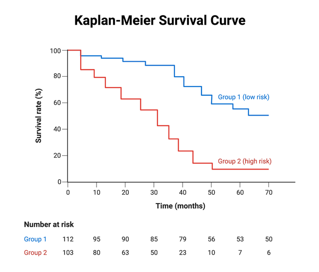
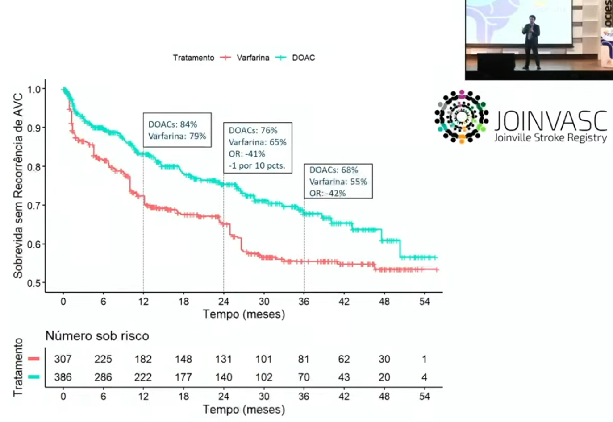
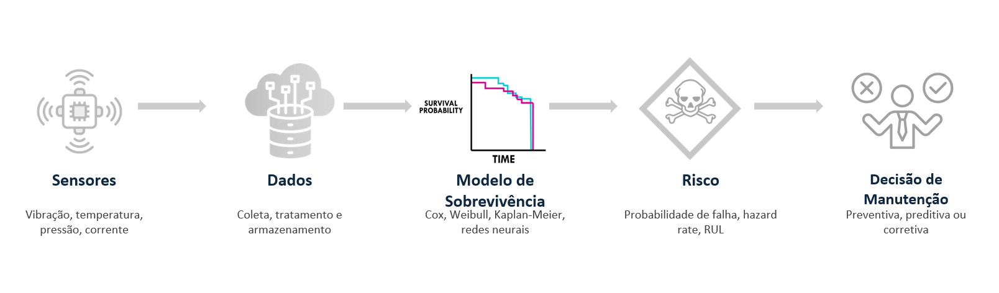

###  [**O que é a time to event models(Survival Analysis)?**]{style="color: #5AC8BE ;"}

- É uma forma de transformar histórico operacional em uma estimativa de quanto tempo resta até o risco virar problema. Isso cria a capacidade de enxergar o tempo como parte da decisão.

<!-- -->

- Existe uma diferença grande entre saber que máquinas falham e saber quando elas provavelmente vão falhar. Na prática, é essa diferença que separa uma operação que vive apagando incêndios de uma operação que toma decisões com antecedência, reduz surpresa, protege produção e usa melhor seus recursos. É aí que entram os Time-to-Event Models, também conhecidos como "Survival Analysis".

<!-- -->

- Apesar do nome técnico, a proposta é muito simples. Em vez de perguntar apenas “vai falhar ou não?”, esses modelos perguntam algo muito mais útil para a industria como “Quanto tempo ainda temos até que o evento crítico aconteça?” ou “Qual é a probabilidade de um determinado sistema continuar operando sem falha até um tempo t?”. E quando o evento é falha, desgaste, manutenção corretiva ou parada de linha, essa pergunta deixa de ser estatística pura e passa a ser vantagem operacional.

- Em vez de olhar apenas para o desfecho final, esses modelos colocam o "tempo" no centro da análise. Em aplicações clássicas, isso foi amplamente usado nas ciências biomédicas; em confiabilidade e manutenção, a mesma lógica passa a representar vida útil, degradação e falha de ativos @hrnjica2021 e @yang2022

- Esses modelos lidam explicitamente com duas características fundamentais:

  - **Censura (censoring)**: quando o evento não ocorre durante o período observado

  - **Tempo variável de observação**: diferentes unidades podem ser acompanhadas por períodos distintos

- No contexto de advanced manufacturing, o “evento” normalmente representa:

  - Falha de equipamento ou componente.
  - Ultrapassagen de um limite de degradação.
  - Necessidade de intervenção de manutenção.
  - Parada não planejada.
  - Descarte prematuro de peça ou ferramenta.

- O ponto mais poderoso aqui é que esses modelos também lidam com uma realidade muito comum na indústria onde nem tudo falha durante o período observado. Muitas vezes, o equipamento saiu da janela de observação ainda funcionando. Isso não é “dado perdido”; isso é **censura**, e Survival Analysis foi feita para tratar exatamente esse tipo de cenário. A literatura de prognóstico de ativos mostra que diferentes formas de censura podem afetar fortemente a modelagem e a interpretação dos resultados em manutenção preditiva.



###  [**Qual o objetivo?**]{style="color: #5AC8BE ;"}

Modelar e prever o tempo até que um evento crítico ocorra, e isso ajuda a resolver alguns problemas no mundo real como:

- Estimar a vida útil de componentes.
- Calcular a função de risco (hazard).
- Avaliar impacto de variáveis explicativas (temperatura, vibração, carga, etc.).
- Apoiar estratégias de manutenção preditiva.

Em ambientes industriais avançados, isso viabiliza a redução de downtime, otimização de plano de manutenção e aumento da confiabilidade operacional. Em um país com foco em manufatura, isso é poder competitivo.

**Abaixo algumas perguntas industriais que são transformadas em algo acionavel através dos resultados dos modelos time to event**

- Qual a probabilidade de um ativo continuar operando até o próximo lote?
- Quais variáveis aceleram o risco de falha?
- Em que faixa de operaçao o risco cresce mais rápido?
- Quando vale investir antes que o custo fuja do controle?

Na prática o que acontece é que a conversa muda de "acho que vai falhar" para "o risco aumenta nessa condição, nessa velocidade e nessa janela de tempo" ou seja, se tornam decisões baseadas em dados.

Em estudos aplicados em manufatura e equipamentos industriais, Survival Analysis aparece como ferramenta para estimar probabilidade de falha, curvas de sobrevivência e fatores que influenciam o tempo de vida útil @hrnjica2024

###  [**De onde vem?**]{style="color: #5AC8BE ;"}

- A motivação industrial surge com crescimento de sensores IoT, disponibilidade de dados temporais ricos e necessidade de migrar de manutenção corretiva para preditiva(ganhos de eficiência para se manter competitivo). Na manufatura moderna, esses modelos são uma resposta à necessidade de reduzir custos operacionais, aumentar eficiência e trabalhar com incerteza real dos processos.

- Os modelos tem origem na medicina através da necessidade de análise de sobrevivência de pacientes com uso de diferentes tratamentos e na industria através de confiabilidade de sistemas de engenharia.



Durante muito tempo, a indústria conviveu com dois extremos sendo a manutenção reativa que é agir depois da falha, e a manutenção preventiva fixa que é agir por calendário ou ciclo, mesmo quando ainda não era necessário. O problema é que os dois extremos **custam caro**.

A reativa gera parada inesperada e urgência. A preventiva fixa pode gerar manutenção em excesso, trocando componentes antes da hora e consumindo recursos sem necessidade. Esse contraste aparece explicitamente na literatura recente sobre manutenção preditiva em ambientes Industry 4.0. @coutinho2025

Em advanced manufacturing, o contexto está mudando:

- Sensores produzem mais dados.
- Operações passam a registrar eventos com maior granularidade.
- A pressão por disponibilidade, eficiência e sustentabilidade aumentou.
- Tornou-se possível integrar estatística, confiabilidade e otimização de decisão.

Nesse cenário, Survival Analysis ganhou força porque faz uma ponte entre três mundos, o da estatística aplicada,engenharia de confiabilidade e decisão operacional baseada em risco.

Em um estudo recente, um framework que combinou modelos de sobrevivência com otimização de agendamento de manutenção reportou 25% de redução de downtime em comparação com métodos não otimizados. O mesmo trabalho avaliou modelos como Cox PH, Random Survival Forests, Gradient Boosting Survival Analysis e Survival SVM para estimar falha e vida útil remanescente.

Isso nasce porque a manufatura precisa sair do manter por hábito para o intervir com inteligência como mostrado nesse vídeo do MIT por Brian Anthony.

::: video-container
<iframe src="https://www.youtube.com/embed/SVDcNxO7siQ?si=qChJGexFtrrN_2uB" frameborder="0" allow="autoplay; encrypted-media" referrerpolicy="strict-origin-when-cross-origin" allowfullscreen>

</iframe>
:::

###  [**Como fazer?**]{style="color: #5AC8BE ;"}

**Dados e bibliotecas**

A implementação será feita na linguagem R e tidyverse com a seguinte estrutura:

- **time:** tempo até evento ou censura
- **event:** indicador (1 = evento ocorreu, 0 = censurado)
- **covariáveis** temperature e vibration

Cada linha no conjunto representa uma unidade observada (máquina, componente, ferramenta, lote ou ativo), o tempo representa o período até a falha ou até o fim da observação, e event informa se a falha realmente aconteceu.

```{r}
#| label: packages
#| warning: false
#| message: false

# pacotes usados
library(tidyverse)
library(survival)
library(survminer)
library(tidymodels)
library(censored)
library(ggsurvfit)


# Exemplo simulado
set.seed(123)

df <- tibble(
  id = 1:200,
  temperature = rnorm(200, mean = 75, sd = 10),
  vibration = rnorm(200, mean = 5, sd = 1)
) %>%
  mutate(
    # Quanto maior temp e vibração, maior a 'taxa' de falha (rate)
    # Subtraímos a média para centralizar e escalamos para gerar variação
    hazard_rate = 0.01 * exp(0.07 * (temperature - 75) + 0.5 * (vibration - 5)),
    time = rexp(n(), rate = hazard_rate),
    event = rbinom(n(), 1, 0.8) # Adicionando censura (nem todos falham no tempo do estudo)
  )
```

**Objeto de sobrevivência**

Criando o objeto de sobrevivência, nós explicamos que não olhamos apenas se "quebrou", mas "quando" quebrou e se a observação foi interrompida (censura). Esse objeto é o coração da análise e ele diz ao modelo `aqui está o tempo, e aqui está se o evento ocorreu ou se a observação foi censurada.`

A ideia é encapsular tempo + evento em uma única variável de resposta.

```{r}
#| label: survival_object
#| warning: false
#| message: false


# criando o objeto sobrevivencia (surv_obj) e grupos que iremos usar lá na frente
df_clean <- df %>%
  mutate(
    temp_group = if_else(temperature > 75, "Alta (>75°C)", "Baixa (<=75°C)"),
    temp_group = fct_relevel(temp_group, "Baixa (<=75°C)"),
    surv_obj = Surv(time, event)
  )

```

**Visualização inicial usando Kaplan-Meier**

Começamos com uma pergunta importante: qual a curva de sobrevivência ? Qual a chance do sistema ainda estar funcionando no tempo t?

A curva mostrada no Kaplan-Meier é uma boa porta de entrada que estima a probabilidade de sobrevivência ao longo do tempo. Esse é um dos modelos clássicos mais usados quando queremos enxergar o comportamento geral do sistema ou comparar grupos.

```{r}
#| label: kaplan-meier
#| warning: false
#| message: false

# rodar o modelo km
km_fit <- survfit(surv_obj ~ 1, data = df_clean)

# plotar kaplan-meier
ggsurvplot(km_fit)


```

**Comparando condições operacionais**

Uma das perguntas mais úteis na indústria: “esse contexto operacional acelera ou desacelera a falha?” Por exemplo, podemos comparar ativos em condição de temperatura alta vs. baixa. Se as curvas se separam, você começa a visualizar algo muito valioso: não apenas se existe diferença, mas como essa diferença se comporta no tempo.

A ideia é trnasformar contexto operacional em variável explicativa, e mostrar a diferença entre os regimes de temperatura.

```{r}
#| label: km_group
#| warning: false
#| message: false

# "Qual a chance do sistema ainda estar funcionando no tempo t?"
km_fit <- survfit2(surv_obj ~ temp_group, data = df_clean)

km_fit %>%
  ggsurvfit() +
  #add_confidence_interval() +
  add_risktable() +
  labs(
    title = "Curva de Sobrevivência Kaplan-Meier",
    subtitle = "Impacto da Temperatura na Confiabilidade do Ativo",
    x = "Tempo de Operação (horas)",
    y = "Probabilidade de Funcionamento"
  )


```

**Modelar risco condicionado as variáveis**

O modelo de Cox Proportional Hazards nos envia para além da visualização quando o objetivo é entender como múltiplas variáveis afetam o risco ao mesmo tempo. Ele é amplamente citado em aplicações de falha e manutenção para identificar covariáveis associadas ao tempo até o evento.

O ponto central aqui é o hazard ratio onde a ideia é modelar risco condicionado as variáveis por exemplo valor maior que 1: aumenta o risco; valor menor que 1: reduz o risco. Os resultados essenciais são - `coeficiente = log risk - exp(coef) = hazard ratio`

Na prática, isso permite sair de uma narrativa vaga (“vibração parece ruim”) para uma narrativa quantitativa (“maior vibração está associada a maior risco relativo”) ou ("Para cada grau Celsius de aumento na temperatura da carcaça, o risco de falha do componente auemnta em 7%").

::: callout-warning
## Muito importante

Cuidado para não confundiir risco relativo com risco absoluto na interpretação e também na comunicação. Para saber mais, sugiro ler Spiegelhalter em The Art of Statistics página 33 na versão Inglês.
:::

```{r}
#| label: cox_ph
#| warning: false
#| message: false

# Definindo a especificação do modelo (usando o pacote censored)
cox_spec <- proportional_hazards() %>%
  set_engine("survival") %>%
  set_mode("censored regression")

# Criando a receita (Recipe)
rec_maint <- recipe(surv_obj ~ temperature + vibration, data = df_clean)

# Montando o Workflow (Passo 5)
maint_wflow <- workflow() %>%
  add_recipe(rec_maint) %>%
  add_model(cox_spec)

# Treinando o modelo
maint_fit <- maint_wflow %>% fit(data = df_clean)

# Visualizando os coeficientes (Hazard Ratios)
maint_fit %>% 
  extract_fit_parsnip() %>% 
  tidy(exp = TRUE, conf.int = TRUE)

```

**Validando uma hipótese importante/diagnóstico teste de proporcionalidade**

O modelo de Cox parte da hipótese de proporcionalidade dos riscos. Se essa hipótese não se sustentar, você por partir para alternativas mais flexíveis como modelos de sobrevivência com machine learning, como Random Survival Forests ou Gradient Boosting Survival Analysis, que já aparecem em aplicações industriais mais recente.

O verdadeiro fluxo é definir claramente o evento relevante, estruturar corretamente tempo e censura, explorar a curva de sobrevivência, comparar condições operacionais, modelar covariáveis que explicam risco e principalmente transformar o resultado em decisão de manutenção, operação ou engenharia. O modelo não é o fim, mas sim o tradutor entre dado histórico e ação futura.

```{r}
#| label: proportional_hazard
#| warning: false
#| message: false

# ExtraI o fit original para usar funções do pacote survival
raw_fit <- maint_fit %>% extract_fit_engine()
test_ph <- cox.zph(raw_fit)

print(test_ph) # Se p > 0.05, a premissa de riscos proporcionais é mantida
plot(test_ph)

```

**Previsão de risco relativo**

```{r}

#| label: relative_risk
#| warning: false
#| message: false


# crate eval time
eval_time <- seq(0, max(df_clean$time), length.out = 100)

# Vamos prever o "hazard score" para os dados originais
predictions <- predict(maint_fit, new_data = df_clean, type = "survival", eval_time = eval_time) %>%
  bind_cols(df_clean)

# Exemplo de predição de risco (linear predictor)
df_risco <- predict(maint_fit, new_data = df_clean, type = "survival", eval_time = eval_time) %>%
  bind_cols(df_clean) %>%
  rename(risk_score = .pred)

head(df_risco %>% select(id, temperature, vibration, risk_score))

```

**Curvas previstas para cenários (Digital Twin Simulado)**

```{r}
#| label: simulation
#| warning: false
#| message: false

# Criando cenários hipotéticos para comparação
cenarios <- tibble(
  temperature = c(65, 85, 95), # Máquina Fria vs Máquina Quente
  vibration = c(4, 5, 7)# Vibração Baixa vs Vibração Alta
) %>%
  mutate(label = c("Operação Ideal", "Alerta Térmico", "Risco Crítico"))

pred_curves <- predict(maint_fit, 
                       new_data = cenarios, 
                       type = "survival", 
                       eval_time = seq(0, 400, by = 5))

pred_curves %>%
  bind_cols(cenarios) %>%
  unnest(.pred) %>%
  ggplot(aes(x = .eval_time, y = .pred_survival, color = label)) +
  geom_step(linewidth = 1) +
  theme_minimal() +
  labs(
    title = "Curvas de Sobrevivência por Cenário Operacional",
    subtitle = "Predição baseada no modelo de Cox PH",
    x = "Tempo Projetado",
    y = "Probabilidade de Sobrevivência",
    color = "Cenário"
  )

```

###  [**Pra onde vai?**]{style="color: #5AC8BE ;"}

Ela pode criar valor para vários públicos ao mesmo tempo, onde para a equipe de manutenção ela ajuda a planejar intervenções com mais antecedência reduzindo surpresas e na melhoria e priorização de ativos críticos, para o time de operações ela aumenta previsibilidade, reduzindo paradas não planejadas e melhora a sincronização entre produção e manutenção, ja na engenharia ela ajuda a identificar variáveis associadas a desgaste e falha, na melhoria do entendimento de regimes de uso e também apoia redesign de processo, componente ou janela operacional.

Outros times também se beneficiam dessa abordagem como o supply chain através de melhora planejamento de reposição reduzindo urgência e compra emergencial e também apoia gestão de peças sobressalentes e data science onde ela oferece uma forma mais realista de modelar fenômenos industriais quando o tempo importa e quando existem observações censuradas.

Esse papel de ponte entre confiabilidade, manutenção e otimização operacional é justamente o que faz esses modelos ganharem relevância em cenários modernos de Industry 4.0



::: callout-note
**E a computação quântica?**

O surgimento de novas tecnologias como computação quantica, pode expandir o espaço de otimização dos modelos time-to-event permitindo resolver problemas que hoje em 2026, ainda são impossíveis ou lentos demais mesmo com MCP e LLMs. Exemplos de ações seriam qual máquina parar primeiro, como alocar equipes, como minimizar downtime, como otimizar rotas de manutenção, como balancear custo vs risco e como simular cenários complexos, ou seja, ela resolveria probemas que hoje são np-hard, combinatórios, com milhões de variáveis e impossíveis de otimizar em tempo real.

Um exemplo hipotético: Usamos o time-to-event para prever quando um avião vai precisar de manutenção e a computação quântica permitiria otimizar toda a malha aérea global para encaixar essa manutenção com o mínimo impacto.
:::

###  [**Qual resultado?**]{style="color: #5AC8BE ;"}

O resultado esperado está em mudar o tipo de conversa que a empresa consegue ter, por exemplo:

- **Antes:** "A falha aconteceu de novo”, “vamos trocar por segurança” ou “não sabemos direito quanto isso aguenta”.

- **Depois:** O risco acelera nesta faixa operacional”, “esse ativo provavelmente sustenta mais ciclos com segurança”, “vale intervir agora ou depois do próximo lote?” ou “qual ativo precisa de atenção primeiro?”

Esse deslocamento se torna um resultado importante porque troca opinião por evidência, urgência por planejamento, reação por antecipação. Em aplicações recentes, Survival Analysis já aparece integrada não só à estimativa de falha e vida útil remanescente, mas também ao agendamento otimizado de manutenção, conectando modelagem estatística a decisão operacional efetiva.

Para quem cria modelos os resultados são modelos mais aderentes à realidade temporal dos ativos, melhor interpretação de risco e conexão clara entre análise e decisão. Para o time os resultados são melhor coordenação entre manutenção, operação e engenharia, menos debate baseado em intuição isolada e maior capacidade de priorizar. Já para a empresa o resultado é redução de downtime, melhor uso de recursos, mais confiabilidade operacional e maior maturidade analítica.

Para a consumidores e ou usuários e ou sociedade, quando operações industriais se tornam mais previsíveis e eficientes, o efeito final tende a incluir menos desperdício, melhor uso de materiais, menor consumo desnecessário de peças e uma manufatura mais sustentável e maior acesso.
